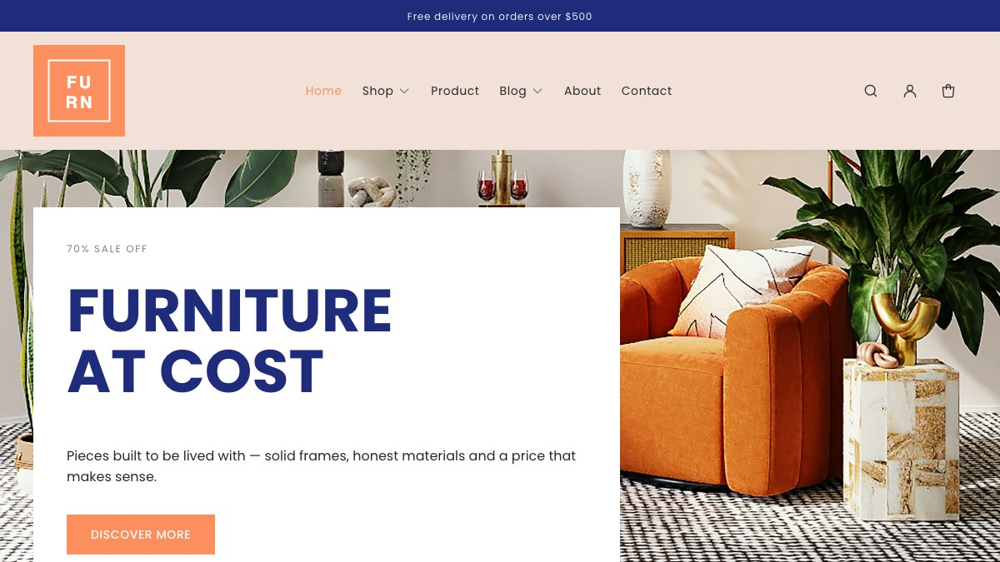
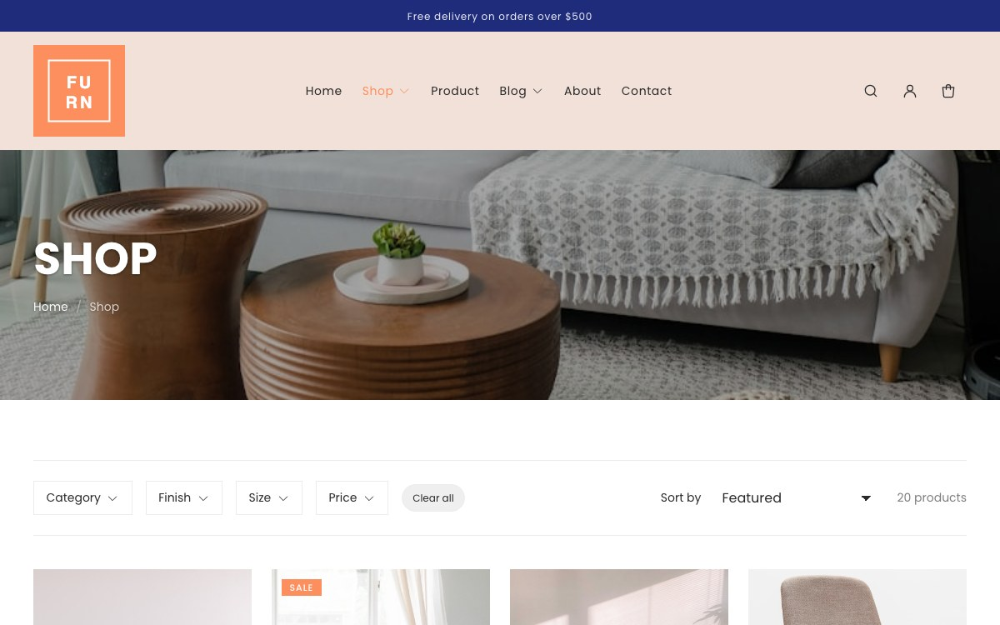
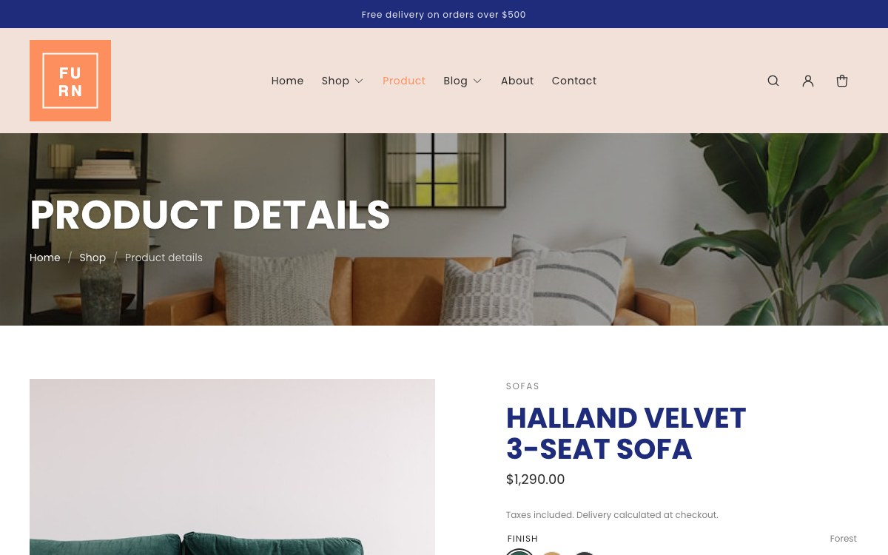
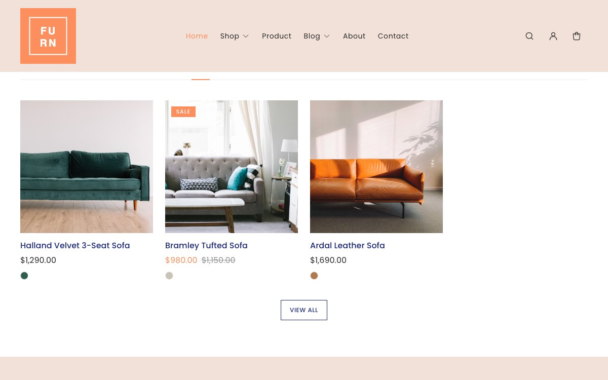
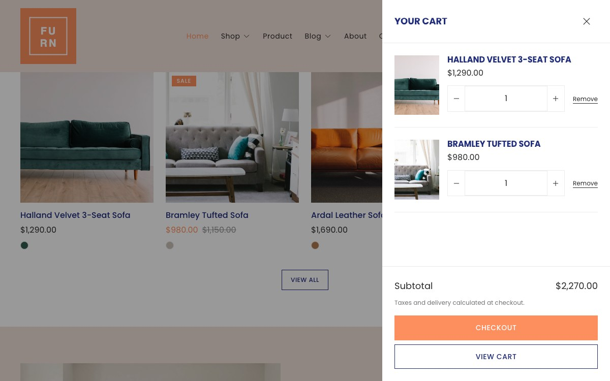
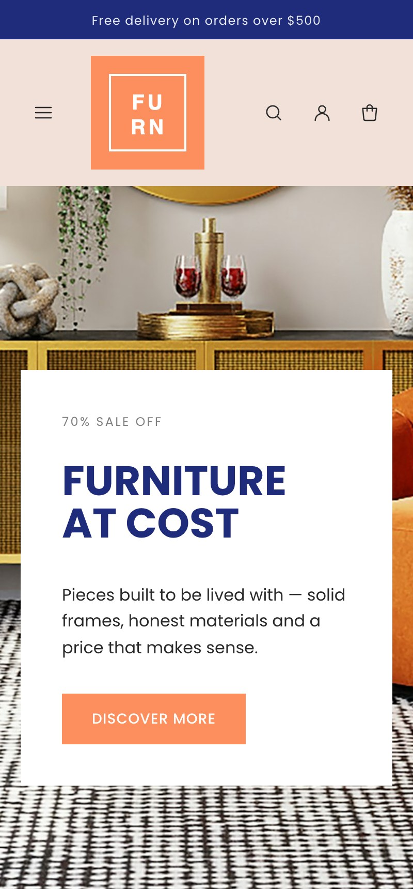
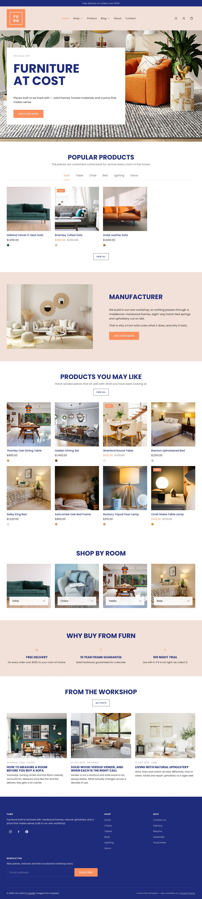
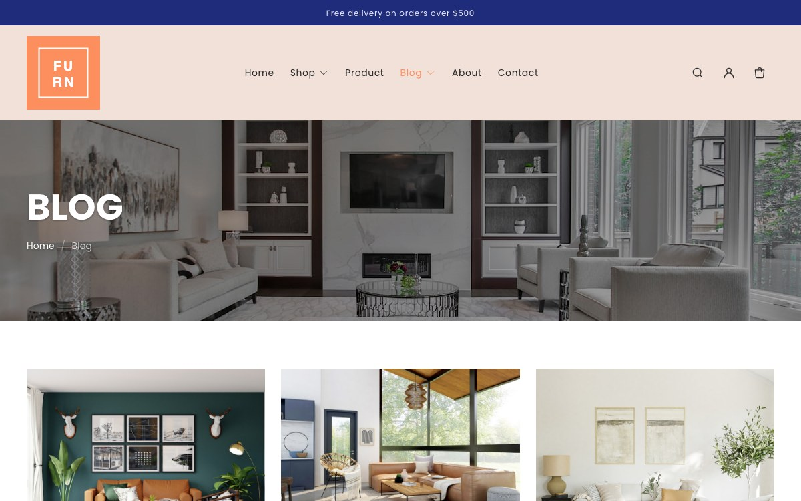
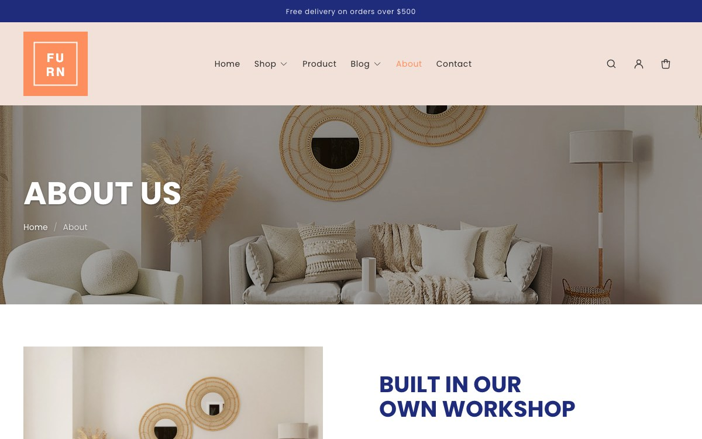

<h1 align="center">Furn — free Shopify theme for furniture and homeware</h1>

<p align="center">
  A free Shopify theme for furniture, homeware and interiors stores, built in 2026 on
  Online Store 2.0 theme blocks.<br>
  No jQuery, no CSS framework, no third-party assets — one stylesheet and one ES module.
</p>

<p align="center">
  <a href="https://preview.colorlib.com/theme/furn/"><strong>Live preview</strong></a> ·
  <a href="https://colorlib.com/wp/themes/furn-free-shopify-furniture-theme/"><strong>Download &amp; FAQ</strong></a> ·
  <a href="https://colorlib.com/wp/free-best-shopify-themes/"><strong>More free Shopify themes</strong></a>
</p>

<p align="center">
  
  
  
  
</p>

<p align="center">
  
</p>

## Preview

**[preview.colorlib.com/theme/furn](https://preview.colorlib.com/theme/furn/)**

The preview is a static build of the same design rather than a live storefront. This theme
and that build share `assets/base.css` — it is literally the same stylesheet — so what you
see there is what the Liquid renders. Cart, filtering, sorting, the tabbed product grid and
predictive search are all demonstrated; on a real store they run against Shopify's own APIs
instead of the demo's local data.

| | |
|---|---|
|  |  |
| **Collection page** — filter by category, finish, size and price | **Product page** — built from movable theme blocks |
|  |  |
| **Tabbed product grid** — one collection per tab, rendered server-side | **Cart drawer** — ajax, no page reload |

<p align="center">
  
  <br><b>Mobile</b> — drawer navigation, scroll-snap carousels, thumb-sized tap targets
</p>

<details>
<summary>The whole homepage, the blog and the about page</summary>
<br>



</details>

## What you get

- **Tabbed product grid** — a homepage section where each tab is one of your collections.
  Every panel renders with the page, so switching tabs is instant, costs no request and
  works with JavaScript disabled.
- **Filterable collections** — filter and sort on collection pages, through Shopify's free
  first-party Search & Discovery app.
- **Product pages built from blocks** — title, vendor, price, variant picker, quantity, buy
  buttons, stock status, description and collapsible rows, each one movable in the editor.
- **Ajax cart drawer** with quick add straight from the product grid.
- **Predictive search** — product, collection, article and page suggestions as you type.
- **Page banners with breadcrumbs** on every inner page, marked up as `BreadcrumbList` so
  the trail can appear in search results.
- **Colour and image swatches** driven by your own Shopify product options.
- **Multi-currency and multi-language** through Shopify Markets.
- **Blog, about, contact** and the full set of customer account pages.
- **Four editable colour schemes**, applied per section, plus font pickers, spacing, corner
  radius and card controls.

## Who it is for

The design is warm and product-led — a coral accent against deep navy, with generous white
space — which suits stores where a customer has to picture the piece in their own room:
furniture makers and retailers, homeware and interiors, lighting, rugs and soft furnishings,
independent showrooms.

Furniture is a considered purchase. People measure a room, compare finishes, worry about the
stairs, and come back three times before they buy, usually on a different device each time.
The theme is arranged around that rather than around impulse checkout:

- **Finish and size sit where the decision happens.** Variant swatches come from your own
  Shopify product options, so oak against walnut, or double against super king, is one tap
  rather than a dropdown.
- **Dimensions and delivery are on the product page, not buried.** Collapsible rows hold the
  measurements, materials and delivery windows that decide a furniture order without pushing
  the price and buy button below the fold.
- **Room-first browsing.** Each collection gets its own tab on the homepage — sofas, tables,
  chairs, beds — so someone who came for one room is one tap from the rest.
- **Stock and lead time up front.** Inventory status sits next to the buy button, so a
  twelve-week wait is not a surprise at checkout.

If you sell hundreds of small, near-identical SKUs where dense listings matter more than
photography, a more compact theme will serve you better.

## What it is, technically

Furn is a **theme-blocks theme** — the newest Shopify theme architecture, the same generation
as Shopify's Horizon themes. Merchants can add, remove, reorder and nest blocks inside
sections directly in the theme editor, including on the product page, which older free themes
only allow on the homepage.

| | |
|---|---|
| Architecture | Theme blocks + JSON templates + section groups |
| Editable in the theme editor | Every template |
| `shopify theme check` | **0 errors, 0 warnings** across 98 files |
| Stylesheets | 1 — `base.css`, 41 KB unminified |
| Scripts | 1 — `theme.js`, 24 KB unminified, an ES module |
| jQuery | none |
| CSS framework | none — ~1,900 lines of plain CSS |
| Carousels | CSS scroll-snap |
| Drawers and modals | native `<dialog>` |
| Icons | inline SVG |
| External CDN requests | none |
| Build step | none — no Sass, no bundler, no minification |
| Download size | 103 KB zip |

For contrast, the HTML template this design comes from loads 16 stylesheets and 27 scripts,
among them jQuery 1.12.4, Bootstrap 4, Owl Carousel, Slick, SlickNav, WOW.js, Magnific Popup,
gijgo, lightSlider and Modernizr. Shopify permits none of that in a theme today, so this is a
rewrite rather than a wrapper.

## Installing

Get the zip from the
**[theme page](https://colorlib.com/wp/themes/furn-free-shopify-furniture-theme/)** (or from
the [Releases](../../releases) tab here), then upload it in **Online Store → Themes → Add
theme → Upload zip file**. Do not unzip it first — Shopify expects the archive. Click
**Customize** to set your logo, colours and menus, and **Publish** when you are happy.

Because Furn uses theme blocks, almost everything after that is drag-and-drop inside the
theme editor: add a section, drop blocks into it, reorder them, and set a colour scheme per
section.

To work on it locally:

```bash
npm install -g @shopify/cli
shopify theme dev --store your-store.myshopify.com   # live preview
shopify theme check                                  # lint (currently: 0 offenses)
shopify theme push                                   # upload
```

## Structure

```
assets/          base.css (design system), theme.js (custom elements)
blocks/          14 theme blocks — reusable and nestable across sections
config/          settings_schema.json, settings_data.json (4 colour schemes, 2 presets)
layout/          theme.liquid, password.liquid
locales/         en.default.json (272 storefront strings)
                 en.default.schema.json (438 theme-editor strings)
sections/        38 sections + 2 section groups (header, footer)
snippets/        18 shared partials (product card, price, cart, facets, schema…)
templates/       19 JSON templates + gift_card.liquid
```

### Sections specific to Furn

Most of the theme is shared with [Fashe](https://github.com/ColorlibHQ/Fashe), which is built
on the same foundation. Two sections are Furn's own:

| Section | What it does |
|---|---|
| `page-header` | The image banner that opens every inner page: title, breadcrumb trail, and `BreadcrumbList` JSON-LD so the crumbs can appear in search results. |
| `tabbed-collections` | The "Popular products" grid where each tab is a collection. Every panel renders server-side, so the grid works with JavaScript off and switching tabs costs no request. It implements the ARIA tabs pattern, including arrow-key, Home and End navigation. |

### Theme blocks

`blocks/` holds blocks merchants can place in any section that accepts `@theme`:

`title` `vendor` `price` `variant-picker` `quantity` `buy-buttons` `inventory`
`description` `accordion` `heading` `text` `button` `image` `group`

`group` accepts child blocks, so layouts can be nested without code.

### JavaScript

One ES module, ~750 lines, all behaviour as custom elements that no-op when their element is
absent:

`quantity-input` `product-form` `cart-drawer` `cart-page` `variant-picker`
`product-gallery` `product-recommendations` `predictive-search` `announcement-rotator`
`address-form` `collection-tabs`

Filtering, cart updates and search results go through the Section Rendering API, so Liquid
stays the single source of truth for markup.

### Design tokens

Taken from the source template: coral `#fd8f5f`, navy `#1f2b7b`, blush `#f2e1d9`, Poppins,
uppercase headings, square corners. Headings carry their own colour in each scheme
(`heading`), so navy titles can sit over neutral body copy, falling back to the text colour
when unset.

Every colour, font and radius above is a theme setting — none of it is hard-coded in the
stylesheet.

### Performance notes

- One stylesheet, one module script, zero external requests.
- All images use `image_tag` with `srcset`, `sizes`, explicit dimensions and lazy loading;
  the hero and the first product image are `eager` + `fetchpriority="high"`.
- Carousels and the product gallery are CSS scroll-snap — no carousel library.
- Drawers are native `<dialog>`, so focus trapping, `Esc` and inert backgrounds come free.
- Motion is disabled under `prefers-reduced-motion`.

### SEO and structured data

Product, BlogPosting and BreadcrumbList JSON-LD; exactly one `<h1>` per page and a clean
heading order under it; canonical URLs; Open Graph and Twitter card tags; responsive images
whose alt text comes from your product data. Breadcrumbs appear on every inner page and are
marked up so they can show in search results.

The theme cannot do the rest for you — your product copy, images and apps still decide the
final result — but it does not work against you, and there is no render-blocking library
stack in front of the first paint.

### Accessibility

Skip link, visible focus rings, labelled form inputs, `aria-current` navigation,
`role="listbox"` search suggestions, the full ARIA tabs pattern on the product grid, 24px+
touch targets, and alt text driven by `image.alt` throughout.

## FAQ

<details>
<summary><b>Is Furn really free?</b></summary>

Yes. Free to download and free to use, with no purchase, no subscription and no trial. There
is no footer credit you have to pay to remove and nothing held back for a paid tier. Use it
on as many Shopify stores as you like, including client stores, and modify it as much as you
need to — the only thing we ask is that you do not repackage and resell the theme itself.
</details>

<details>
<summary><b>Do I need a paid Shopify plan?</b></summary>

You need an active Shopify plan to publish any theme on a live store, Furn included — that is
Shopify's charge, not ours. You can upload and preview it during a Shopify trial or on a
development store at no cost, and everything the theme does works on Shopify's entry-level
plans.
</details>

<details>
<summary><b>Do I need to know how to code?</b></summary>

No. Sections, blocks, colours, fonts, menus, images and layout are all set from Shopify's
theme editor. Because Furn is built on theme blocks you can add, reorder and nest content on
every template, including the product page. Touching Liquid is optional, not a prerequisite.
</details>

<details>
<summary><b>Which apps does it need?</b></summary>

None to run. Product filtering on collection pages uses Shopify's free first-party Search &
Discovery app, and multi-currency uses Shopify Markets. Both are made by Shopify, both are
optional, and no paid third-party app is required for the theme to function.
</details>

<details>
<summary><b>What is the difference between this and the HTML version of Furn?</b></summary>

Same design, different platform. This is a Shopify theme written in Liquid that runs on a
Shopify store with real products, a cart and checkout. The
[Furn HTML template](https://colorlib.com/wp/template/furn/) is a **paid**, plain static site
you can host anywhere, and it is the better starting point if you want to port the design to
WooCommerce, a static site generator or a JavaScript framework. Both are built from the same
stylesheet, so they look identical. This Shopify theme is the free one.
</details>

<details>
<summary><b>Can I edit the code?</b></summary>

Yes, and it is designed to be readable. There are exactly two asset files — `base.css` and
`theme.js` — with no build step, no minification and no Sass to compile, so what you see in
Shopify's code editor is what runs. Work in the admin code editor or locally with the
Shopify CLI.
</details>

## Known gaps

- Only English ships. Both locale files are complete and fully keyed, so adding a language is
  a matter of translating `en.default.json` and `en.default.schema.json`.
- Not yet rendered against a live store with real inventory — see CHANGELOG.

## Contributing

Issues and pull requests are welcome. Please run `shopify theme check` before opening a PR;
the theme is at zero offenses and should stay there.

## Licence

Free to use and modify on any number of Shopify stores, including stores you build for
clients. The one thing we ask is that you do not repackage and resell the theme itself as
your own product.

Note that the [Furn HTML template](https://colorlib.com/wp/template/furn/) this design is
ported from is a **paid** template — this Shopify theme is the free one. Demo imagery is from
Unsplash and is not redistributed with the theme.

## Credits

Built by [Colorlib](https://colorlib.com). Based on the
[Furn HTML template](https://colorlib.com/wp/template/furn/); architecture shared with the
[Fashe Shopify theme](https://github.com/ColorlibHQ/Fashe).
